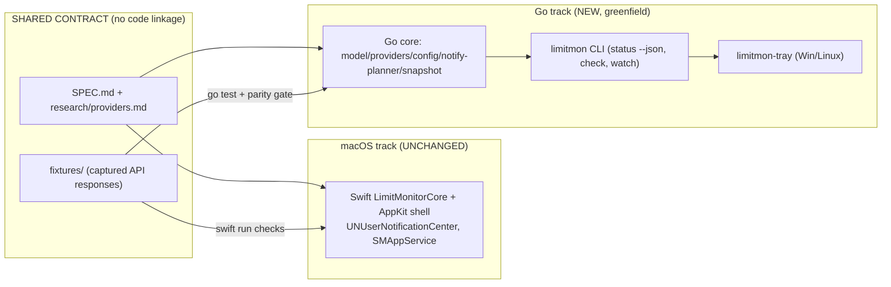

# Cross-platform design: shared Go core + Windows/Linux tray

> Status: **Phase-1 architecture, roasted (concept-roaster 7/10, strategy approved).**
> The 6 round-1 fixes below are NORMATIVE and override the body where they conflict.
> No implementation yet — this is the contract for the staged Go track.

## Round-1 roaster fixes (normative)

1. **Verifiability honesty.** The fixture-parity CI gate is the ONLY *rigorous* proof, and it covers the **parse layer only** (adapters/config/dot-path/Decimal). Per-OS creds, the poll scheduler, and notification delivery are NOT fixture-coverable — they are validated on real Win/Linux boxes. The `limitmon status --json` vs Swift-bar live cross-check is a **loose, timing-dependent smoke** (the API rejitters `resets_at` every request), not a strict diff.
2. **Increment 1 is split.** First PR = the fixture-parity harness + `internal/model` + `internal/config` (dot-path + Decimal) + 2–3 adapters (claude/codex/cursor). The parity gate lands **first**, so every later adapter is gated as it is written. Remaining adapters, creds, CLI, snapshot, labels, poll follow in batched PRs.
3. **macOS snapshot ownership.** On macOS the Go `limitmon` **reads but never writes** `~/Library/Application Support/limit-monitor/widget-snapshot.json` (the Swift app owns it). On Windows/Linux the Go daemon owns its own snapshot path. This avoids a two-writer race on the shared file.
4. **JSONKeyTree stays in `check`.** The keys-only (no values, depth ≤3) JSON key-tree diagnostic is ported into `limitmon check` — it is the only way to debug codex/cursor schema drift on the Win/Linux machines the maintainer cannot see.
5. **No false confidence on the unverifiable layers.** `modernc.org/sqlite` reading a live 5.6 GB WAL DB read-only, and Linux SNI `SetTitle` rendering a dynamic text title, are **unverified assumptions** gated on real-box validation (increments 2/3). Cursor stays experimental on the Go track; on stock GNOME the title may degrade to tooltip-only.
6. **Corrected evidence.** The Swift reference has ~122 `check()` assertions (not 562); `math/big.Rat` is a full money-format *reimplementation* (~150 LOC incl. half-up-to-scale + $1.2k formatting), not a drop-in for `shopspring/decimal`.

---

# DESIGN — cross-platform limit-monitor: shared Go core + Windows/Linux tray

Status: PROPOSAL (Phase 1 architecture, no implementation). Scratch — not the repo.
Roadmap item: `[ ] Cross-platform core — shared Go core + Windows/Linux tray apps` (README:222).
Feeds: concept-roaster critique.

Context baseline (what actually ships today, verified by reading the source):
- macOS Swift SPM app is at **v0.7.0 and feature-COMPLETE**: Claude + Codex + Cursor
  builtins, config/custom providers (OpenRouter/DeepSeek/Moonshot/Zhipu + siliconflow/novita
  presets + generic-http), settings window with checkboxes, snapshot + `--status --json`,
  desktop card, EN/RU i18n, 562-ish `checks` assertions.
- `LimitMonitorCore` is Foundation-only, pure, and is the real contract: `Models.swift`
  (`Level`, `LimitEntry`), `Providers.swift`, `ConfigAdapters.swift`, `ProviderState.swift`,
  `Notifications.swift` (`NotificationPlanner.plan`), `WidgetSnapshot`, `Labels`/`Language`
  (neutral `LabelDescriptor` + EN/RU catalog), `JSONPath` (dot-path + Decimal), `CodexAuth`/
  `CursorAuth` (JWT decode, pure).
- OS coupling lives in the shell target `limit-monitor/`: `/usr/bin/security`,
  `/usr/bin/sqlite3 -readonly`, `/bin/sh -c` (key commands), `URLSession` fetchers with
  per-provider headers/timeouts, `ProviderRuntime` per-provider timers + stale rules,
  `SnapshotStore` atomic write, `Notifier` (`UNUserNotificationCenter` + `SMAppService`,
  guarded by `isRunningInBundle`).

---

## 0. Open questions for the orchestrator (not blocking the draft)

These are decisions I made as assumptions; a human may want to overrule:
1. **Fixtures location.** I assume `macos/fixtures/` gets promoted to a repo-root `fixtures/`
   shared by both `swift run checks` (CWD-relative path already) and `go test`. One-time move,
   updates the Swift `checks` path. If the owner wants to keep them under `macos/`, Go tests
   point there instead — cosmetic.
2. **Two binaries vs one.** I recommend two: pure-Go `limitmon` (CLI/core, cgo-free, the
   locally-verifiable artifact) and `limitmon-tray` (GUI, per-OS). A single binary with a
   `tray` subcommand behind build tags is the fallback if the owner wants one artifact.
3. **Cursor SQLite dependency.** Increment 1 shells to `sqlite3 -readonly` when present, else
   marks Cursor inactive; the tray increment MAY adopt pure-Go `modernc.org/sqlite`. If a
   zero-dependency rule is absolute, Cursor stays shell-out-only and degrades on bare Windows.

---

## 1. STRATEGY — the load-bearing call (FIRM)

### Decision

**Option A — TWO TRACKS, one contract.** Keep the shipped Swift macOS app **exactly as-is**.
Build a **new, greenfield Go core + `limitmon` CLI + Windows/Linux trays** that
**reimplements** the same provider recipes. Share **nothing at the binary/FFI level**. The
shared contract is the **SPEC + captured `fixtures/`**, enforced by a **fixture-parity CI gate**.

Rejected: **Option B** (Go core becomes the single source of truth; macOS Swift app is
retrofitted into a thin shell that consumes `limitmon watch --json` over a subprocess).
Rejected harder: **Option C** (rewrite the macOS GUI in Go). Rejected explicitly: any
**CGo/FFI bridge or macOS sidecar** linking Swift to a Go core.

### Why (and why the research memo's Option-B rationale is now stale)

`research/landscape.md` §4 argues for eventual convergence: "Swift app switches its data
source to `limit-monitor watch --json` and **gets Cursor/Codex dots for free**." That
sentence was written when the Swift app was **Claude-only P1**. It is now **v0.7, complete**.
There is **no "free" feature** left for macOS to gain from the Go core. Convergence today is
**all cost, zero user-visible benefit**:

- It rips out working, tested code — `UsageFetcher`, `CodexUsageFetcher`, `CursorUsageFetcher`,
  `CustomProviderPoller`, the whole `ProviderRuntime` timer/isolation model, three credential
  providers with hand-tuned watchdogs (10s Keychain, 5s sqlite, process-group SIGKILL for key
  commands) — and replaces it with a **subprocess supervisor + NDJSON parser**: new failure
  surface (Go binary absent / wrong version / crashed / different config interpretation /
  PATH discovery / zombie reaping / version drift between shell and core).
- It **cannot even collapse to "one core"**: to keep native `UNUserNotificationCenter`
  (which needs a `.app` bundle) and `SMAppService` login items, the Swift shell must still run
  the **notification planner and scheduling**. So either the Go core emits a plan the Swift
  side schedules (contract duplicated anyway) or the Swift side keeps `NotificationPlanner`
  (core logic in BOTH). Convergence does not eliminate the second implementation of the
  load-bearing logic; it just moves the seam and adds IPC.
- macOS Swift has strictly BETTER behavior we would lose or have to bridge: **pre-scheduled**
  reset notifications via `UNCalendarNotificationTrigger` (fire on time even if asleep at
  reset), attributed-string per-segment colored dots, ad-hoc-signed dist pipeline, 562
  assertions. A Go daemon can only fire in-process timers.

### The one real cost of Option A, and how it is bounded

The honest downside is **dual maintenance of the recipe parsers** — two implementations of
alias-tolerant Codex parsing, Zhipu HTTP-200-error branching, OpenRouter `/key`→`/credits`
chaining, JWT decode, dot-path/Decimal money handling. Cursor/Codex endpoints churn
(`cursor-stats`, 263 stars, was archived over exactly this). Mitigation makes the cost
mechanical, not architectural:

1. **`fixtures/` is the single shared truth.** Both `swift run checks` and `go test` parse the
   SAME captured responses. When an endpoint changes, the expensive work — research + capturing
   a new fixture — is done ONCE; porting the parser tweak to the second language is mechanical.
2. **Fixture-parity CI gate.** A CI job feeds every fixture through the Go adapters, emits a
   canonical normalized JSON, and diffs it against a golden that the Swift `checks` also
   validate. Drift fails the build. This is the gate that makes two codebases safe.
3. **One normative recipe doc.** `macos/SPEC.md` (v0.4 section + `research/providers.md`) is
   already normative; the Go port cites section numbers in comments, same as the Swift code
   already does (`ConfigAdapters.swift` cites "research/providers.md §1").
4. **Named revisit trigger.** If parity drift causes more than a couple of production bugs per
   quarter, revisit convergence — but design for it **only then** (YAGNI). Do not pay the IPC
   tax speculatively.

### Why this is the correct call, bluntly

The actual market gap (`landscape.md` §1.2, F6) is **tri-OS tray — nobody has it**. macOS is
**over-served** (CodexBar 18.5k stars, openusage, Claude Usage Tracker). The value is on
**Windows and Linux, where there is literally nothing**, and there the Swift app is irrelevant.
So the work is **additive greenfield** where it matters and **zero-touch** on the polished,
finished thing. Betting the shipping product on a migration to reach parity it already has is
the kind of resume-driven architecture that gets people fired.



---

## 2. Go module layout

Mirror the Swift `Core / shell` split: a pure core (no I/O, no OS calls, deterministic under an
injected clock) and a thin OS layer behind build tags. Packages (contracts only below — no
implementation is written in this doc):

```
limit-monitor/
  go.mod                       # module github.com/OWNER/limit-monitor
  fixtures/                    # PROMOTED from macos/fixtures — shared with swift checks
  internal/
    model/        # Level, Limit, ProviderState, thresholds — port of Models.swift+ProviderState.swift
    providers/    # adapter interface + claude, codex, cursor, config/generic adapters
                  #   port of UsageParser/CodexParsing/CursorParsing/ConfigAdapters
    config/       # providers.json schema + loader + KeySource + dot-path/Decimal (JSONPath port)
    creds/        # per-OS secret+path resolution: creds_darwin.go / _windows.go / _linux.go
                  #   + pure auth.json/JWT/cookie logic (CodexAuth/CursorAuth port), no OS coupling
    notify/       # PURE planner (NotificationPlanner.plan port) + per-OS delivery behind build tags
    snapshot/     # WidgetSnapshot v2 writer/reader + atomic write (SnapshotStore port)
    labels/       # neutral LabelDescriptor + EN/RU catalog (Labels/Language port), for CLI render
    poll/         # per-provider goroutine scheduler + isolation + stale rules (ProviderRuntime port)
  cmd/
    limitmon/     # CLI: status | status --json | check | watch --json | autostart | notify-test
    limitmon-tray/# GUI daemon: systray + notify delivery + autostart (Win/Linux); build-tagged
```

### The provider interface (design contract — signatures, not bodies)

The Swift `AdapterResult` enum maps to a Go result struct; adapters are **pure parse functions**
of `(raw, httpStatus, now)`. Networking lives in the shell, exactly like Swift.

```
// model
type Level int          // Green<Yellow<Orange<Red; Level.From(percent, severity) mirrors Models.swift:11
type Limit struct {     // 1:1 with LimitEntry (Models.swift:33) minus AppKit concerns
    Provider, Kind, Group        string
    Percent                      int
    Severity                     string
    ResetsAtRaw                  string
    ResetsAt                     *time.Time
    ScopeName                    string
    WindowMinutes                *int
    WindowLabel                  *string     // "" = none, nil = derive
    Unlimited, MenuOnly          bool
    ProviderName                 string      // config display name
    BalanceText                  string      // balance-mode
    LevelOverride                *Level
    ExhaustedOverride            *bool
}
type ProviderState int  // Ok, ConfigError, KeyError, BadKey, NoPlan, Blocked, Info, FetchError, ParseError
                        //   + IsCheckFailure() mirrors ProviderState.swift:26

// providers
type AdapterResult struct {
    Entries      []Limit
    State        ProviderState
    Reason       string      // localized via lang, never a value/secret
    NeedsCredits bool        // openrouter /key → /credits chain (AdapterResult.needsCredits)
}
type Adapter interface {
    Parse(raw []byte, httpStatus int, now time.Time, lang Language) AdapterResult
}
```

- **Builtin adapters** (`claude`, `codex`, `cursor`, `openrouter`, `deepseek`, `moonshot`,
  `zhipu`) are hand-written Go, one file each, citing the SPEC section they implement. They
  carry the logic the generic engine deliberately can't: OpenRouter's two-call fallback,
  Zhipu's `code 1001`/`500 + "coding plan"` branching and `unit`→minutes window mapping,
  Moonshot's envelope + host currency, DeepSeek's decimal-string multi-currency array + okFlag,
  Codex's alias-tolerant primary/secondary/additional normalization + `wham`→`codex` fallback.
- **Generic engine** (`generic-http`) is data-driven from config `GenericExtract`
  (`balance`/`limit`/`percentUsed`/`okFlag` dot-paths), identical to `GenericAdapter.swift`.
  `siliconflow`/`novita` are internally-expanded generic configs (presets), same as Swift.
- **Dot-path + Decimal**: port `JSONPath` — split on `.`, integer segment = array index,
  value may be JSON number OR decimal string (strip thousands `,`). Go stdlib has no decimal;
  use `shopspring/decimal` (pure Go, ubiquitous) — the ONE justified core dependency, with
  `math/big.Rat` as the zero-dep fallback if the owner vetoes it.

### Polling / isolation / stale (port of `ProviderRuntime` + `App.swift` timers)

- One **goroutine + `time.Ticker` per enabled provider**, own interval: claude 60s, codex 180s,
  cursor 300s, config = `pollSeconds` (clamp ≥60). First tick fires immediately at launch.
- Per-provider `runtime{ lastSuccess, health, limits, polling }` in a supervisor map; a mutex
  or per-provider channel serializes apply. One provider failing/stale **never** marks another
  stale (matches App.swift).
- **Stale** = `tokenExpired || badKey` → immediately; else `now - lastSuccess > max(600s,
  2*interval)` (the 10-min rule for fast builtins, 2 intervals for slow config providers) —
  exact port of `ProviderRuntime.isStale`.
- **Re-read credentials every poll** (Claude Code / Codex / Cursor all rotate). NEVER refresh.
- **Wake-from-sleep**: best-effort per-OS (Windows `WM_POWERBROADCAST`, Linux logind
  `PrepareForSleep` DBus signal); non-blocking, only relevant to the long-running `watch`/tray,
  N/A to the stateless `status` CLI. macOS is not a Go-tray target so `NSWorkspace` is out of
  scope here.

---

## 3. Cross-platform credential & path matrix

**Hard invariant (all OSes): read whatever the vendor CLI wrote, read-only, NEVER refresh a
token, NEVER log/print token / sub / account_id / cookie / config body.** We never create our
own secret store; we only read the artifact the user's Claude Code / Codex / Cursor already
maintains. The decisive cross-platform fact below is that **on Windows and Linux there is no
Keychain, so Claude Code itself writes plaintext `~/.claude/.credentials.json`** — confirmed by
`usage-monitor-for-claude` (Windows) reading exactly that file (`landscape.md` §1.1). So we do
NOT need DPAPI or libsecret for the Claude token today.

| Secret / file | macOS (Go) | Windows (Go) | Linux (Go) | Notes |
|---|---|---|---|---|
| **Claude OAuth token** | `security find-generic-password -s "Claude Code-credentials" -w` (subprocess, cgo-free); fallback `~/.claude/.credentials.json` | `%USERPROFILE%\.claude\.credentials.json` (Claude Code has no Keychain here) | `~/.claude/.credentials.json` | Same JSON shape `{claudeAiOauth:{accessToken,expiresAt(ms)}}`. `expiresAt` past / HTTP 401 → token-expired state, keep last data. If a future Claude Code adopts libsecret (Linux) / CredMan (Windows), add a build-tagged backend THEN. |
| **Codex `auth.json`** | `$CODEX_HOME/auth.json` else `~/.codex/auth.json` | `%CODEX_HOME%` else `%USERPROFILE%\.codex\auth.json` | same as macOS | Plaintext JSON on every OS (Codex never used a keystore) → trivially portable, just `os.UserHomeDir()` + `$CODEX_HOME`. `account_id` fallback = base64url JWT payload → `chatgpt_account_id` (top-level or nested `https://api.openai.com/auth`) — pure, port of `JWTDecoder`. API-key-only file → provider inactive with reason. |
| **Cursor `state.vscdb`** | `~/Library/Application Support/Cursor/User/globalStorage/state.vscdb` | `%APPDATA%\Cursor\User\globalStorage\state.vscdb` | `~/.config/Cursor/User/globalStorage/state.vscdb` | Read **strictly read-only**, never copy (5.6 GB, live-written). See SQLite decision below. Token → `unquote` → `sub` JWT claim → cookie `WorkosCursorSessionToken=<sub>::<token>` (pure, port of `CursorAuth`). |
| **`providers.json`** | `$LIMIT_MONITOR_PROVIDERS` else `~/.config/limit-monitor/providers.json` | `$LIMIT_MONITOR_PROVIDERS` else `%APPDATA%\limit-monitor\providers.json` | `$LIMIT_MONITOR_PROVIDERS` else `~/.config/limit-monitor/providers.json` | Env override honored everywhere (matches Swift). macOS default kept at `~/.config/...` (NOT `os.UserConfigDir()` = `~/Library/...`) so a macOS user's existing config is found by BOTH apps. chmod-600 permission check on unix; on Windows report ACL-permissive best-effort or skip. |
| **`key.command` source** | `/bin/sh -c <cmd>`, 10s deadline, process-group SIGKILL on timeout | `cmd /C <cmd>` (POSIX-shell commands do NOT port) | `/bin/sh -c <cmd>` | On Windows, `command` keys need cmd/PowerShell-native syntax; recommend `env` / `literal` / a Windows secret helper there. Document the gap. Resolve on EVERY poll; never store; never log. |
| **Snapshot** | `~/Library/Application Support/limit-monitor/widget-snapshot.json` (kept for Swift-app interop) | `%LOCALAPPDATA%\limit-monitor\widget-snapshot.json` | `~/.local/state/limit-monitor/widget-snapshot.json` (XDG state) | Atomic: temp-in-same-dir (`.widget-snapshot-<pid>.tmp`) + `os.Rename` (replaces existing on all three since Go 1.5; keep temp same-dir to avoid cross-device failure). Schema **v2, neutral** — no localized strings, no secrets; readers reconstruct labels. |

### SQLite (Cursor) — read-only, cgo-free, decision

The requirement: read one indexed value (`SELECT value FROM ItemTable WHERE
key='cursorAuth/accessToken'`) from a huge, actively-written DB, read-only, zero mutation,
ideally zero cgo. Options weighed:

- **Shell to `sqlite3 -readonly`** (what Swift does): zero-dep, zero-cgo, but `sqlite3` is NOT
  installed by default on Windows and can be absent on minimal Linux → fragile cross-OS.
- **`mattn/go-sqlite3`**: cgo → breaks cross-compilation from the Mac. **Rejected.**
- **`modernc.org/sqlite`**: **pure Go, cgo-free**, cross-compiles cleanly. Heavier binary
  (transpiled SQLite), but correct and portable. Open with `?mode=ro` + `busy_timeout=2000`
  (honors WAL, matches Swift's `.timeout 2000`; do NOT use `immutable=1` on a live-written DB —
  risks torn/stale reads). Single point query, short timeout, wrap in recover so a failure
  degrades to "cursor inactive", never a crash.

**Recommendation:** Increment 1 (`limitmon` CLI, zero-dep bias) shells to `sqlite3 -readonly`
when present, else marks Cursor inactive with a clear reason (Swift already distinguishes
`.failed` vs `.empty`). The **tray increment** adopts `modernc.org/sqlite` (still cgo-free) as
the robust default on Windows/Linux where `sqlite3.exe` is missing. Both paths are read-only.

---

## 4. Tray + notifications stack

### Library pick: `fyne-io/systray` (tray) + DBus/`notify-send` (Linux) + WinRT/AUMID toast (Windows)

| Library | Verdict | Reason |
|---|---|---|
| **fyne (full toolkit)** | REJECT | OpenGL window toolkit; huge binary, GL/X deps on Linux; we render NO window, only a tray. |
| **wails** | REJECT | WebView2 (Win) / webkit2gtk (Linux) — a web stack for a UI that has no web. Same reason the memo killed Tauri/Electron. |
| **energy** | REJECT | CEF/Chromium embedded — heaviest of all. |
| **fyne-io/systray** | **PICK** | Purpose-built tray/menu-bar. Windows = Win32 `Shell_NotifyIcon` via `syscall` (**cgo-free**). Linux = StatusNotifierItem over DBus (**no GTK**, cgo-free). macOS = cgo (irrelevant — Swift owns macOS). Menu items, icon, tooltip, `SetTitle`. Minimal-dep, matches project philosophy. |

Notifications: pure planner (Go port of `NotificationPlanner.plan`, identical identifiers /
minute-rounded stamps / dedup) decides WHAT to fire; **delivery** is per-OS behind build tags.
Linux → `org.freedesktop.Notifications` (godbus) or `notify-send`. Windows → WinRT toast bound
to an **AUMID** shortcut installed by `install.ps1` (an unpackaged exe shows as "PowerShell"
without AUMID — `landscape.md` §5). Deliver **in-process** from the long-running daemon.

### Load-bearing platform limitation: the dynamic title

The entire product identity is the bar text `5h●42% │ 7d●29% ┃ Cx·5h●12%`. Reality:

| Capability | macOS (Swift, shipped) | Linux (Go / SNI) | Windows (Go / systray) |
|---|---|---|---|
| Dynamic **text title** by the icon | YES (`NSStatusItem` attributed) | YES (`SetTitle`, SNI) | **NO** — Windows tray = icon + hover **tooltip** only |
| Per-limit **colored dots** | YES | YES (● in title text) | icon = single worst-level color / badge; dots live in tooltip + menu text |
| **Menu rows** with colored dots | YES | YES (● in menu text) | YES (menu text) |
| Native notifications | `UNUserNotificationCenter`, **pre-scheduled** (fires while asleep) | dbus/notify-send, **in-process** timer | WinRT toast + AUMID, **in-process** timer |
| Autostart | `SMAppService` | `~/.config/autostart/*.desktop` | `HKCU\...\Run` (no admin) |
| Tray visible out of the box | YES | **NO on stock GNOME** — needs AppIndicator extension | YES |

Consequences to accept and document, not fight:
- On **Windows the percentages live in the tooltip + menu, not the bar**. The icon encodes the
  worst level (color / number badge). Set user expectation explicitly; this is an OS limit, not
  a bug.
- **Pre-scheduled reset notifications are macOS-only.** The Go daemon fires reset+5s from an
  in-process timer while running; if the box is asleep/off at reset it fires on next
  wake/poll. Exhaustion notifications (immediate) port perfectly. This asymmetry is another
  reason NOT to converge macOS onto the Go core.
- **GNOME AppIndicator caveat** is mandatory README/llms-install content (Ubuntu preinstalls
  it, Fedora does not; KDE/XFCE fine).

---

## 5. Build / distribution / verifiability

### Cross-compilation

- **`limitmon` (CLI/core)**: `CGO_ENABLED=0` → builds for `{darwin,linux,windows} ×
  {amd64,arm64}` from ANY host, including the maintainer's Mac. This is the artifact he can
  fully test and cross-compile locally.
- **`limitmon-tray`**: fyne-io/systray is cgo-free on **Linux (DBus)** and **Windows
  (syscall)** → both cross-compile from the Mac (but cannot be RUN there). We ship NO macOS Go
  tray, so the cgo-on-darwin path is never used.

### CI matrix (extend the existing `ci.yml`, which is macos-14 + Swift only)

Add a Go workflow (or jobs) — keep the Swift job untouched:

| Runner | Job | Purpose |
|---|---|---|
| `macos-14` | Swift build + `checks` (EXISTING) | unchanged |
| `macos-14` | `go test ./...` + cross-compile ALL targets | proves the core builds+tests on the maintainer's platform and every target compiles |
| `ubuntu-latest` | `go test ./...`, `go vet`, build Linux + Windows trays, headless `limitmon status --json` smoke against fixture creds | Linux core + tray build + CLI smoke |
| `windows-latest` | `go test ./...`, build + launch-smoke of the tray (`--version` / starts), toast smoke if feasible | the one place Windows toast/SmartScreen behavior is machine-checkable pre-release |
| any | **fixture-parity gate**: Go adapters → canonical JSON per fixture, diff vs golden the Swift `checks` also validate | the anti-drift gate that makes Option A safe |

### Release artifacts & signing reality

- **GoReleaser** produces per-OS/arch archives for `limitmon` + `limitmon-tray` + `install.sh`
  / `install.ps1`, published as ADDITIONAL assets under the release. The existing macOS `.app`
  zip pipeline (`release.yml`) stays untouched.
- **macOS**: `curl | sh` does NOT set `com.apple.quarantine` → Gatekeeper never triggers; the
  CLI is not a GUI → no notarization needed. brew **formula** (NOT cask) for `limitmon` — the
  formula path is unaffected by Homebrew's 2026-09 cask/Gatekeeper change (`landscape.md` §5).
- **Windows**: unsigned `.exe` → SmartScreen "Unknown publisher" **only** on browser download;
  `irm | iex` and `curl.exe` bypass MOTW → no SmartScreen. Document. No code-signing cert
  unless a GUI-download audience materializes.
- **Linux**: no signing concept for a raw binary; `curl | sh` → `~/.local/bin`; AppImage later.
  GNOME AppIndicator caveat documented.

### What IS vs ISN'T verifiable on the maintainer's macOS machine (item #5, critical)

| Verifiable locally on the Mac | Needs CI runner and/or a real Win/Linux box |
|---|---|
| `go test ./...` — all adapters/planner/config/dot-path against `fixtures/` | Windows toast rendering + AUMID sender identity |
| Fixture-parity vs Swift `checks` | SmartScreen / MOTW behavior on real download |
| `limitmon status --json` / `check` against his REAL local creds (Keychain, `auth.json`, `state.vscdb`, `providers.json`) — cross-check the numbers match the Swift bar | Linux SNI tray actually appearing (esp. stock GNOME) |
| Cross-compile every `{os,arch}` target (proves it builds) | Tray dynamic-title vs tooltip fidelity; colored-icon rendering |
| `go vet` | Autostart entries (`.desktop`, `HKCU Run`) taking effect |
| The pure notification PLANNER output | wake-from-sleep hooks; in-process reset firing timing |

Design consequence: the tray's **data layer IS the already-verified CLI core**; only the thin
**presentation** (systray glue + OS notify shim) is unverifiable on the Mac. Keep that layer as
small as possible so "unverifiable" means "a few hundred lines of glue", not "the product".

---

## 6. Staged increment plan

| Increment | Deliverable | Buildable on Mac | Runnable/verifiable on Mac | Needs CI / real box |
|---|---|---|---|---|
| **1 — Go core + `limitmon` CLI** (first PR) | `internal/{model,providers,config,creds,notify(planner),snapshot,labels}` + `cmd/limitmon` (`status`, `status --json`, `check`). All adapters ported; all 3-OS path/secret backends written (only macOS runnable locally). Fixtures promoted to `fixtures/`. Go CI jobs + parity gate added. | YES (cgo-free, cross-compiles all targets) | **YES** — `go test`, parity vs Swift, `status --json`/`check` on real creds | parity gate + ubuntu/windows `go test` in CI |
| **2 — Linux tray** | `cmd/limitmon-tray` (SNI/DBus), dbus/notify-send delivery, `.desktop` autostart, `install.sh`, adopt `modernc.org/sqlite` for Cursor. | YES (cgo-free DBus) | build only (cannot render SNI on macOS) | ubuntu CI build+smoke; real Linux box for visual + GNOME AppIndicator check |
| **3 — Windows tray** | `cmd/limitmon-tray` (systray syscall), WinRT/AUMID toast, `HKCU Run` autostart, `install.ps1` + AUMID shortcut. Document tooltip-not-title limit. | YES (cgo-free syscall) | build only | windows-latest build+launch smoke; real Windows box for toast/SmartScreen/visual |
| **4 — Distribution polish** (on demand) | brew formula, scoop/winget, AppImage; agent-install block + `llms-install.md` updates for the new binaries. | YES | partial | packaging CI |

Explicitly **NOT** an increment: converging the macOS Swift app onto the Go core; a macOS Go
tray. Both rejected in §1.

---

## 7. Open risks & non-goals

### Risks

1. **Dual-maintenance drift** — the core cost of Option A. Mitigated by shared `fixtures/` +
   parity CI + one normative recipe doc. Revisit convergence only if drift causes >~2 prod
   bugs/quarter.
2. **Cursor endpoint churn** (`cursor-stats` archived over it) — Cursor stays **experimental**
   on the Go track too; degrade to inactive, never crash. Re-read token every poll.
3. **Windows has no bar text** — percentages in tooltip + menu; icon carries worst level. Sets
   an expectation gap vs macOS; document up front.
4. **Reset pre-scheduling is macOS-only** — Go daemon uses in-process timers (fires on
   wake/next poll if asleep at reset). Exhaustion notifications unaffected.
5. **SQLite on bare Windows/Linux** — no `sqlite3.exe`; resolved by `modernc.org/sqlite`
   (cgo-free) in the tray increment, or Cursor stays inactive.
6. **GNOME hides tray icons** without AppIndicator extension — documented caveat, not a bug.
7. **`key.command` is POSIX-shell-shaped** — degrades on Windows (`cmd /C`); recommend
   `env`/`literal` there.
8. **Maintainer cannot visually verify Win/Linux trays** — reliance on CI build+smoke + a real
   box/VM + trusted-tester feedback; keep the unverifiable glue layer minimal.
9. **New Go dependencies** vs Swift's zero-dep: `shopspring/decimal` (money correctness),
   optionally `modernc.org/sqlite` (Cursor), `fyne-io/systray` (tray), `godbus` (Linux notify).
   Each is justified and scoped; core CLI stays cgo-free and can fall back to `math/big` if the
   owner vetoes shopspring.
10. **`steipete` (CodexBar) could ship Win/Linux and close the gap first** — external, out of
    our control; the CLI-first `status --json` quota-API + agent-native install remain
    differentiated regardless.

### Non-goals

- Rewriting, replacing, or retrofitting the shipping Swift macOS app.
- A macOS Go tray.
- Any CGo/FFI/sidecar binary bridge between Swift and Go — the contract is SPEC + fixtures,
  not linkage.
- Refreshing any OAuth token, on any OS (hard invariant).
- Creating our own secret store (DPAPI/libsecret/Keychain-write) — we only READ what the vendor
  CLI wrote.
- New providers beyond the current SPEC set.
- WidgetKit / web UI / Electron / Tauri / a full GUI toolkit.
- Feature parity of the Windows tray's bar text with macOS (OS-limited; tooltip instead).

---

## Decision summary table

| Question | Decision |
|---|---|
| Go core replaces Swift, or parallel? | **Parallel (Option A).** Swift macOS untouched; Go is greenfield for CLI + Win/Linux. |
| Shared how? | SPEC + `fixtures/` + parity CI gate. **No** binary/FFI linkage. |
| Module split | pure `internal/{model,providers,config,creds,notify,snapshot,labels,poll}` + `cmd/{limitmon,limitmon-tray}`. |
| Claude creds cross-OS | Keychain (macOS) + `~/.claude/.credentials.json` everywhere (Win/Linux have no keystore). No DPAPI/libsecret today. |
| Codex / Cursor creds | `auth.json` plaintext (path per OS); `state.vscdb` read-only (path per OS). JWT/cookie decode pure. Never refresh. |
| SQLite | shell `sqlite3 -readonly` in inc.1; pure-Go `modernc.org/sqlite` (`mode=ro`+busy_timeout) in tray inc. No cgo. |
| Tray lib | `fyne-io/systray` (cgo-free Win/Linux); reject fyne/wails/energy. |
| Notifications | pure planner port; delivery per-OS (dbus / WinRT+AUMID), in-process; pre-scheduling is macOS-only. |
| Windows title | not possible — tooltip + menu + worst-level icon. |
| Dist | GoReleaser adds Go artifacts; brew **formula**; unsigned + `curl|sh`/`irm|iex` (no quarantine/MOTW). |
| First PR | Go core + `limitmon` CLI — fully testable + cross-compilable on macOS. |
```